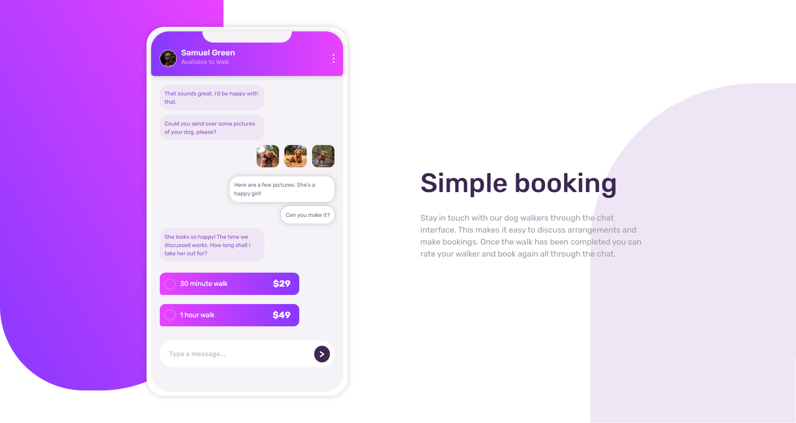

# Frontend Mentor - Chat app CSS illustration solution

This is a solution to the [Chat app CSS illustration challenge on Frontend Mentor](https://www.frontendmentor.io/challenges/chat-app-css-illustration-O5auMkFqY). Frontend Mentor challenges help you improve your coding skills by building realistic projects. 

## Table of contents

- [Overview](#overview)
  - [The challenge](#the-challenge)
  - [Screenshot](#screenshot)
  - [Links](#links)
- [My process](#my-process)
  - [Built with](#built-with)
  - [What I learned](#what-i-learned)
  - [Continued development](#continued-development)
- [Author](#author)

## Overview

### The challenge

Users should be able to:

- View the optimal layout for the component depending on their device's screen size
- **Bonus**: See the chat interface animate on the initial load

### Screenshot

### Links

- Solution URL: [Netlify Live URL](https://dashing-marigold-22f2ad.netlify.app/)
- Live Site URL: [Github repo](https://github.com/Robertron624/chat-app-css-illustration)

## My process

### Built with

- Semantic HTML5 markup
- CSS custom properties
- Flexbox
- CSS Grid
- Mobile-first workflow

### What I learned

With this project I kept improving my CSS Grid to create a responsive layout. I also stept up my layout skills for creating a smartphone mockup from scratch with HTML and CSS.

### Continued development

I want to complete all intermediate frontend mentor challenges before taking on the advanced ones. I also want to learn more about React and Next.js for projects that require multiple pages and are fullStack. I want to learn more about CSS animations and transitions.

## Author

- Personal Website - [Robert Ramirez](https://robert-ramirez.netlify.app)
- Frontend Mentor User- [@Robertron624](https://www.frontendmentor.io/profile/Robertron624)
- Twitter - [@robertdowny](https://www.twitter.com/robertdowny)

